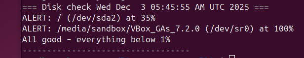

# linux-server-toolkit
Real-world scripts I actually run on my own servers.  
Built while pursuing Help desk/IT support/admin roles to expand expertise

## Why this exists
I lost patience with:
- Running low on disk space unexpectedly
- Wanting to verify who logged in as root last week
- Unexpectedly breaking things when I upgrade a server

So I automated the boring and the risky.

## The Three Scripts
| Script              | What it does                                                         |Real job skill it demonstrates                   |
|---------------------|----------------------------------------------------------------------|---------------------------------------------|
| `disk-watcher.sh`   | Alerts via Pushover/email if any partition > 85 % full                | Monitoring + proactive support              |
| `login-auditor.sh`  | Lists last 10 logins + highlights root/direct logins & failed attempts | Security awareness + log analysis           |
| `safe-upgrade.sh`   | Runs apt update/upgrade, logs everything, reboots only if kernel updated | Change management + basic automation        |

## Screenshots


## Tested on
- Ubuntu 24.04 LTS
- Runs on personal lab servers

## Quick Start
```bash
git clone https://github.com/YOUR-USERNAME/linux-server-toolkit.git
cd linux-server-toolkit
cp config.example config
# edit config with your Pushover keys or email
chmod +x *.sh
./disk-watcher.sh   # test it
